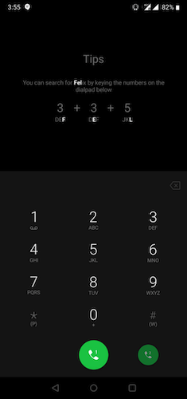
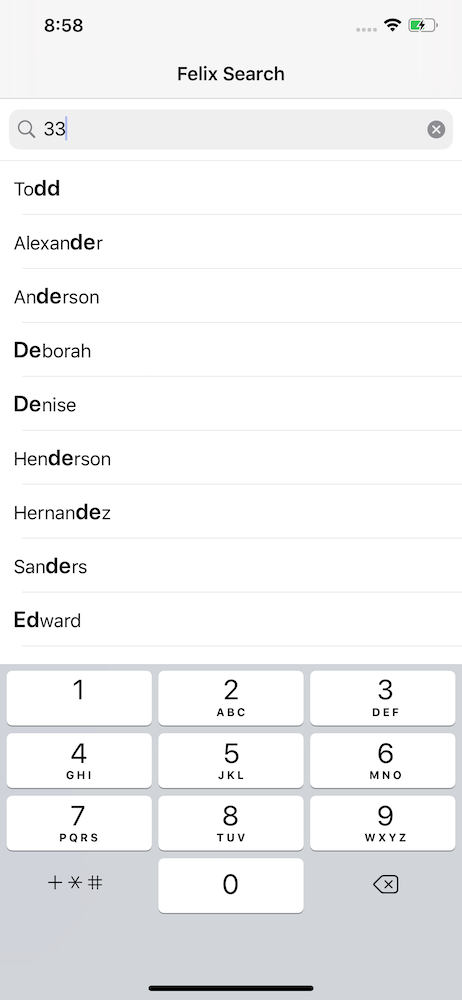

# Felix-Search
 A simple iOS app which mimics OnePlus's dialer pad search which is also known as Felix Search

## Meaning and use case

When we use the dialer app, all we can type are numbers. But if we have to search contacts using name before dialing, felix search can help you.
As we know, the numpad keys are associated with letters. For example, the key 2 is associated with characters d,e,f.
Felix search utilises combination of these characters to search your contacts and find results

An example explaining the above statament is the following screenshot (Taken from OnePlus's dialer app): 

This app is a demo app which demonstrates the base algorithm of Felix search. Any suggestions / improvements are always welcome!

## Screenshots from the app

## License

Usage is provided under the [MIT License](http://opensource.org/licenses/mit-license.php).  See LICENSE for the full details.

## Contributions

All contributions are welcome. Please fork the project to add functionalities and submit a pull request to merge them in next releases.
